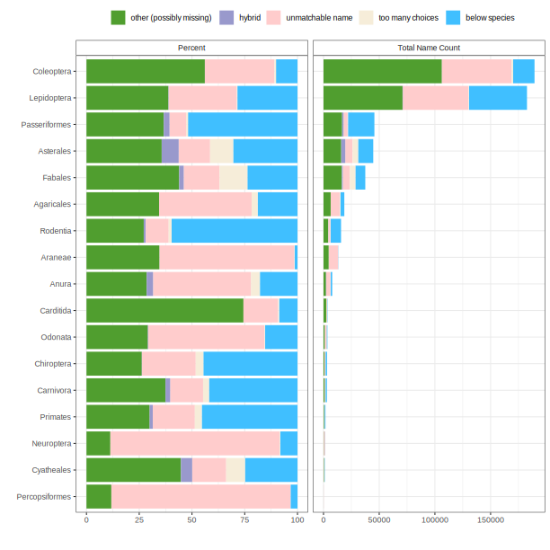

When publishers supply GBIF with a **scientific name**, this name is sometimes not found in the [GBIF taxonomic backbone](https://www.gbif.org/dataset/d7dddbf4-2cf0-4f39-9b2a-bb099caae36c). In these cases, the occurrence record usually gets a data quality flag called **taxon match higher rank**. This means that GBIF was only able to match the name to a **higher rank** (e.g. a genus, family, order ...).  

<!--more-->

At GBIF, we would like it if the name supplied by the publisher always matched to the lowest rank possible, so when a user comes to GBIF, looking for a certain name, they will have access to the largest amount of occurrence data possible. 

## Common reasons for higher rank matches 

1) Name is **poorly formatted**.
2) Name is **misspelled**. 
3) Name is an [OTU](https://en.wikipedia.org/wiki/Operational_taxonomic_unit) (which is acceptable but not usually in the GBIF backbone).
4) Name is **missing** from the backbone.
5) Name is **incomplete** (missing authorship).

In the graph below I divide **names** (not occurrences) supplied to GBIF from publishers that have received the [taxon match higher rank flag](https://www.gbif.org/occurrence/search?issue=TAXON_MATCH_HIGHERRANK&advanced=1).

* <b>other</b> : means that I could not find a good reason for why this name did not match to the backbone. This could be a misspelling or the name could truly be **missing from the GBIF backbone**. These are names which might represent **data gaps**. 
* <b>hybrid</b> : means the name is referring to hybrid. We expect poor checklist coverage for hybrid names. 
* <b>below species</b> : meaning the name matched at a taxonomic rank below the species level. Usually we expect less checklist coverage for **subspecies** and **varieties**. 
* <b>too many choices</b> : is a special category for when GBIF has two or more names with different authorship, but the publishers fails to supply authorship, so the name cannot be matched. 
* <b>unmatchable names</b> : is a catch all group for poorly formatted or un-matchable names. See table below. 

I have processed some names from select groups to see if there are <b>gaps</b> for GBIF to fill. 

Here we see that GBIF is probably missing many names from **Coleoptera** (Beetles) and **Lepidoptera** (Butterflies/Moths). There are also many potential missing names within birds, but this might be dues to the large number of occurrence records we get from this groups (Passeriformes). 

If we break down **Beetles** by family we see that **Chrysomelidae** (Leaf beetles) are responsible for a large portion of the [missing names](https://www.gbif.org/occurrence/search?offset=20&issue=TAXON_MATCH_HIGHERRANK&taxon_key=7780) in Beetles. 

For most **unmatchable names**, it is not really possible for GBIF or publishers to correct these errors. However, when only authorship is missing publishers might be able to help correct the issue. 

## Too many choices 

Sometimes publishers do not provide enough information for GBIF to choose between names in the backbone. For example, if a publisher only supplied us with **Glocianus punctiger** we would not be able to determine between the [two choices](https://www.gbif.org/species/search?q=Glocianus%20punctiger), and it would get moved to the **higher rank** (genus Glocianus).

**Providing authorship** would allow GBIF to correctly match these occurrences to backbone. 

## Unmatchable names

Publishers supply GBIF with a variety of what I call **unmatchable names**, which are names that are impossible to match to the GBIF backbone. Sometimes these names are ok names but still missing from the backbone, like **missing hybrids** or **OTUs**. Other names are simply bad names that we can't expect to fix. Some examples below.

| name not matched to species in backbone | reason  | link | 
|-------|-------|----- |
| **Mystery mystery** | bad name | [records](https://www.gbif.org/occurrence/search?advanced=1&verbatim_scientific_name=Mystery%20mystery)
| **Sonus naturalis** | bad name |[records](https://www.gbif.org/occurrence/search?issue=TAXON_MATCH_HIGHERRANK&advanced=1&verbatim_scientific_name=Sonus%20naturalis)
| **Bambusoideae spec.** | genus name | [records](https://www.gbif.org/occurrence/search?issue=TAXON_MATCH_HIGHERRANK&advanced=1&verbatim_scientific_name=Bambusoideae%20spec.)
| **Coleoptera indet.** | order name |[records](https://www.gbif.org/occurrence/search?issue=TAXON_MATCH_HIGHERRANK&advanced=1&verbatim_scientific_name=Coleoptera%20indet.)
| **Astarte juv.** | family name | [records](https://www.gbif.org/occurrence/search?issue=TAXON_MATCH_HIGHERRANK&advanced=1&verbatim_scientific_name=Astarte%20juv.)
| **Gen. sp.**| bad name | [records](https://www.gbif.org/occurrence/search?issue=TAXON_MATCH_HIGHERRANK&advanced=1&verbatim_scientific_name=Gen.%20sp.)
| **Astarte sp. BIOUG14667-B01** | family with id | [records](https://www.gbif.org/occurrence/search?offset=0&issue=TAXON_MATCH_HIGHERRANK&advanced=1&verbatim_scientific_name=Astarte%20sp.%20BIOUG14667-B01)
| **Phoneutria depilata (Strand 1909) sp. reval.** | bad name |[records](https://www.gbif.org/occurrence/search?issue=TAXON_MATCH_HIGHERRANK&advanced=1&verbatim_scientific_name=Phoneutria%20depilata%20(Strand%201909)%20sp.%20reval.)
| **Anisoptera Unknown Dragonfly Species** | group name |[records](https://www.gbif.org/occurrence/search?issue=TAXON_MATCH_HIGHERRANK&advanced=1&verbatim_scientific_name=Anisoptera%20Unknown%20Dragonfly%20Species)
| **Zygoptera** | group name | [records](https://www.gbif.org/occurrence/search?issue=TAXON_MATCH_HIGHERRANK&advanced=1&verbatim_scientific_name=Zygoptera)
| **Philodromus Philodromus albidus / rufus** | missing hybrid | [records](https://www.gbif.org/occurrence/search?issue=TAXON_MATCH_HIGHERRANK&advanced=1&verbatim_scientific_name=Philodromus%20albidus%20~2F%20rufus)
| **Corvus corone x C. cornix** | missing hybrid | [records](https://www.gbif.org/occurrence/search?issue=TAXON_MATCH_HIGHERRANK&advanced=1&verbatim_scientific_name=Corvus%20corone%20x%20C.%20cornix)
| **Certhia brachydactyla/Certhia familiaris** | missing hybrid |[records](https://www.gbif.org/occurrence/search?issue=TAXON_MATCH_HIGHERRANK&advanced=1&verbatim_scientific_name=Certhia%20brachydactyla~2FCerthia%20familiaris)
| **BOLD:ADV7315** | OTU | [records](https://www.gbif.org/occurrence/search?issue=TAXON_MATCH_HIGHERRANK&advanced=1&verbatim_scientific_name=BOLD:ADV7315) |
| **BOLD:ADX5419** | OTU | [records](https://www.gbif.org/occurrence/search?issue=TAXON_MATCH_HIGHERRANK&advanced=1&verbatim_scientific_name=BOLD:ADX5419) |

If a name is truly missing from the GBIF backbone, GBIF would like to **fill that data gap**. This can be done by updating the checklists that feed into the [backbone construction process](https://data-blog.gbif.org/post/gbif-backbone-taxonomy/). 

