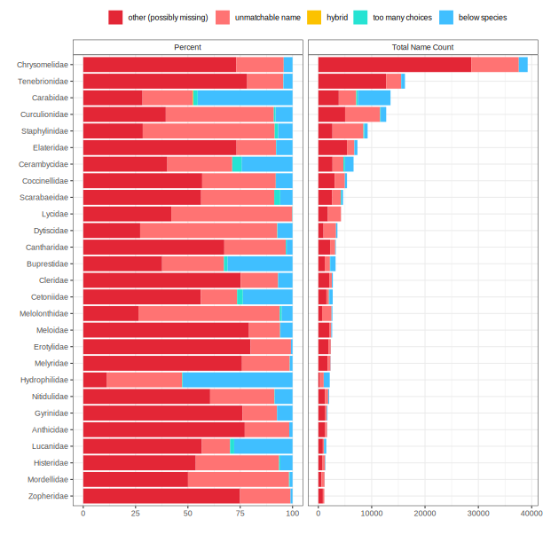
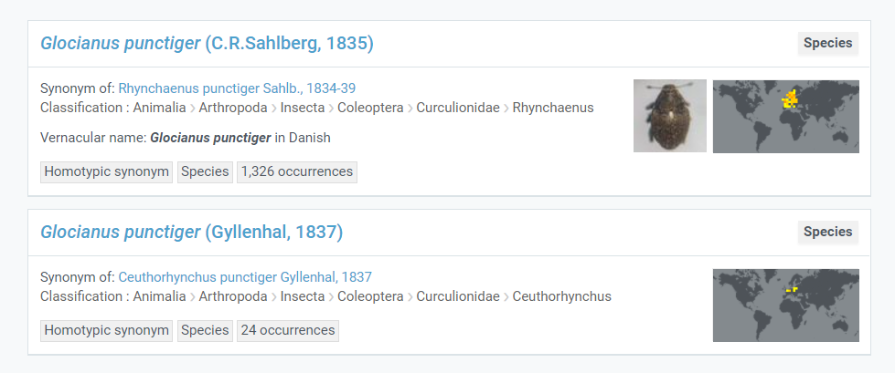

When publishers supply GBIF with a **scientific name**, this name is sometimes not found in the [GBIF taxonomic backbone](https://www.gbif.org/dataset/d7dddbf4-2cf0-4f39-9b2a-bb099caae36c). In these cases, the occurrence record gets a data quality flag called **taxon match higher rank**. This means that GBIF was only able to match the name to a **higher rank** (genus, family, order ...).  

<!--more-->

At GBIF, we would always like match the name supplied by the publisher to the lowest rank possible, so that when a user comes to GBIF looking for a certain name, they will have access to the largest amount of occurrence data.

<!--
## Common reasons for higher rank matches: 

1) Name is **poorly formatted**.
2) Name is **misspelled**. 
3) Name is an [OTU](https://en.wikipedia.org/wiki/Operational_taxonomic_unit) (which is acceptable but not usually in the GBIF backbone).
4) Name is **missing** from the backbone.
5) Name is **incomplete** (missing authorship).
-->

In the graph below I divide **names** (not occurrences) supplied to GBIF from publishers that have received the [taxon match higher rank flag](https://www.gbif.org/occurrence/search?issue=TAXON_MATCH_HIGHERRANK&advanced=1).

* <b>other</b> : means that I could not find a good reason for why this name did not match to the backbone. This could be a misspelling or the name could be **missing from the GBIF backbone**. These are names which might reflect **data gaps**. 
* <b>unmatchable name</b> : is a catch-all group for poorly formatted or unmatchable names (see below). 
* <b>hybrid</b> (hybrid formula) : means the name is referring to hybrid. We expect poor checklist coverage for hybrid names. 
* <b>below species</b> : means a name at a taxonomic rank below the species level could not be matched at that level. Usually we expect less checklist coverage for **subspecies** and **varieties**. 
* <b>too many choices</b> : GBIF has two or more names with different authorship (homonyms), but the publishers does not provide authorship and/or higher taxonomy, so the name cannot be matched unambiguously.  

I have processed some names from select groups to see if there are <b>gaps</b> for GBIF to fill. 

Here we see that GBIF is probably missing many names from **Coleoptera** (Beetles) and **Lepidoptera** (Butterflies/Moths). There are also many potential missing names within birds, but this might be due to the large number of occurrence records we get from this group (Passeriformes). 

If we break down **Beetles** by family we see that **Chrysomelidae** (Leaf beetles) are responsible for a large portion of the [missing names](https://www.gbif.org/occurrence/search?offset=20&issue=TAXON_MATCH_HIGHERRANK&taxon_key=7780) in Beetles. 

## Too many choices 

Sometimes publishers do not provide enough information for GBIF to choose between names in the backbone. For example, if a publisher only supplied us with **Glocianus punctiger** we would not be able to determine between the [two choices](https://www.gbif.org/species/search?q=Glocianus%20punctiger), and it would get moved to the **higher rank** (genus Glocianus).

**Providing authorship** would allow GBIF to correctly match these occurrences to backbone. 

## Unmatchable names

Publishers supply GBIF with a variety of what I call **unmatchable names**, which are names that are impossible to match to the GBIF backbone. Sometimes these names are ok names but still missing from the backbone, like **missing hybrids** or **OTUs**. Other names are simply bad names that we can't expect to fix. Some examples below:

| name not matched | reason  | link | 
|-------|-------|----- |
| **Mystery mystery** | bad name | [records](https://www.gbif.org/occurrence/search?advanced=1&verbatim_scientific_name=Mystery%20mystery)
| **Sonus naturalis** | bad name |[records](https://www.gbif.org/occurrence/search?issue=TAXON_MATCH_HIGHERRANK&advanced=1&verbatim_scientific_name=Sonus%20naturalis)
| **Bambusoideae spec.** | subfamily name | [records](https://www.gbif.org/occurrence/search?issue=TAXON_MATCH_HIGHERRANK&advanced=1&verbatim_scientific_name=Bambusoideae%20spec.)
| **Coleoptera indet.** | order name |[records](https://www.gbif.org/occurrence/search?issue=TAXON_MATCH_HIGHERRANK&advanced=1&verbatim_scientific_name=Coleoptera%20indet.)
| **Astarte juv.** | genus name with life stage | [records](https://www.gbif.org/occurrence/search?issue=TAXON_MATCH_HIGHERRANK&advanced=1&verbatim_scientific_name=Astarte%20juv.)
| **Gen. sp.**| bad name | [records](https://www.gbif.org/occurrence/search?issue=TAXON_MATCH_HIGHERRANK&advanced=1&verbatim_scientific_name=Gen.%20sp.)
| **Astarte sp. BIOUG14667-B01** | family with id | [records](https://www.gbif.org/occurrence/search?offset=0&issue=TAXON_MATCH_HIGHERRANK&advanced=1&verbatim_scientific_name=Astarte%20sp.%20BIOUG14667-B01)
| **Phoneutria depilata (Strand 1909) sp. reval.** | species name with remark |[records](https://www.gbif.org/occurrence/search?issue=TAXON_MATCH_HIGHERRANK&advanced=1&verbatim_scientific_name=Phoneutria%20depilata%20(Strand%201909)%20sp.%20reval.)
| **Anisoptera Unknown Dragonfly Species** | infra-order name with remarks |[records](https://www.gbif.org/occurrence/search?issue=TAXON_MATCH_HIGHERRANK&advanced=1&verbatim_scientific_name=Anisoptera%20Unknown%20Dragonfly%20Species)
| **Zygoptera** | suborder name | [records](https://www.gbif.org/occurrence/search?issue=TAXON_MATCH_HIGHERRANK&advanced=1&verbatim_scientific_name=Zygoptera)
| **Philodromus Philodromus albidus / rufus** | doubtful identification (alternative) | [records](https://www.gbif.org/occurrence/search?issue=TAXON_MATCH_HIGHERRANK&advanced=1&verbatim_scientific_name=Philodromus%20albidus%20~2F%20rufus)
| **Certhia brachydactyla/Certhia familiaris** | doubtful identification (alternative) |[records](https://www.gbif.org/occurrence/search?issue=TAXON_MATCH_HIGHERRANK&advanced=1&verbatim_scientific_name=Certhia%20brachydactyla~2FCerthia%20familiaris)
| **Corvus corone x C. cornix** | missing hybrid | [records](https://www.gbif.org/occurrence/search?issue=TAXON_MATCH_HIGHERRANK&advanced=1&verbatim_scientific_name=Corvus%20corone%20x%20C.%20cornix)
| **BOLD:ADV7315** | OTU | [records](https://www.gbif.org/occurrence/search?issue=TAXON_MATCH_HIGHERRANK&advanced=1&verbatim_scientific_name=BOLD:ADV7315) |
| **BOLD:ADX5419** | OTU | [records](https://www.gbif.org/occurrence/search?issue=TAXON_MATCH_HIGHERRANK&advanced=1&verbatim_scientific_name=BOLD:ADX5419) |

If a name is truly missing from the GBIF backbone, GBIF would like to **fill that data gap**. This can be done by updating the checklists that feed into the [backbone construction process](https://data-blog.gbif.org/post/gbif-backbone-taxonomy/). 

## Other (possibly missing)

As a non-expert it is hard to tell if a name is a **data gap**, just a **misspelling** or something else. So how many possibly missing names are actual **data gaps**? To check, I randomly sampled [five possibly missing names from each group](https://docs.google.com/spreadsheets/d/1WprHkAa6bez58T3YQrmXD4AknEwLGtscsNL92L-g-0I/edit?usp=sharing) in the graph above to check if I could manually locate a source outside GBIF with the name. 

Around **50%** (44 of 86) of the **possibly missing** names appear to be **genuinely missing** from the GBIF backbone. We can therefore conservatively assume that there are thousands of missing names in the GBIF backbone. Keep in mind, however, that many missing names are **missing synonyms**—that is, they are not unique taxon concepts. Halving this number (25%) we can make a conservative **minimum missing names table**: 

| group          |friendly name	| min estimated missing names* 	|
|----------------|------------- |-----------------------------	|
| Coleoptera     | Beetles      |	26,600             	          |
| Lepidoptera    | Butterflies	| 17,700             	          |
| Passeriformes  | Bird order 	| 4,200              	          |
| Fabales        | Plant order  | 4,100               	        |
| Asterales      | Plant order	| 4,000               	        |
| Agaricales     | Mushrooms  	| 1,600               	        |
| Araneae        | Spiders      | 1,200               	        |
| Rodentia       | Rodents    	| 1,100               	        |
| Carditida      | Bivalves   	| 700                  	        |
| Anura          | Frogs      	| 600                  	        |
| Carnivora      | Carnivores 	| 300                  	        |
| Odonata        | Dragonflies	| 300                  	        |
| Chiroptera     | Bats       	| 200                  	        |
| Cyatheales     | Ferns      	| 100                  	        |
| Primates       | Primates   	| 100                  	        |
| Neuroptera     | Insect order	| <100                   	      |
| Percopsiformes | Fish order 	| <100                   	      |

<small> *Based on conservative judgment that 25% of potentially missing names are genuinely missing from GBIF backbone. Download a full table of possibly missing names from the groups above [here](data/possibly_missing_table.zip). </small>

This table, of course, gives us no indication about **how well described** a certain group is; it just reflects the relative completeness of the GBIF backbone. This table also includes fossils, which might inflate some groups (such as primates). Also, these counts do not necessarily represent unique **species concepts** but just unique **name strings** that GBIF receives.    

## GBIF data publisher advice 

As a data publisher, there are few things that can be done to improve name matching to the **GBIF backbone**. 

1. Run your dataset through the [data validator](https://www.gbif.org/tools/data-validator) and examine any names that get the data quality flag **taxon match higher rank**.  
2. Attempt to match your names to the GBIF backbone before publishing using the [name matcher](https://www.gbif.org/tools/species-lookup) or [rgbif](https://docs.ropensci.org/rgbif/reference/name_backbone_checklist.htm). 
3. Check if your names all have **authorship** (if possible).
4. Fill known **higher-taxonomy**. 
5. Try to avoid working name **placeholders** for the dwc:scientificName, but rather fill in the lowest known rank. 
6. Do **not** use **ALL CAPS** for names. 
7. Do not put **identification qualifiers** in the dwc:scientificName field but rather use the [dwc:identificationQualifier](http://rs.tdwg.org/dwc/terms/identificationQualifier) field. 

